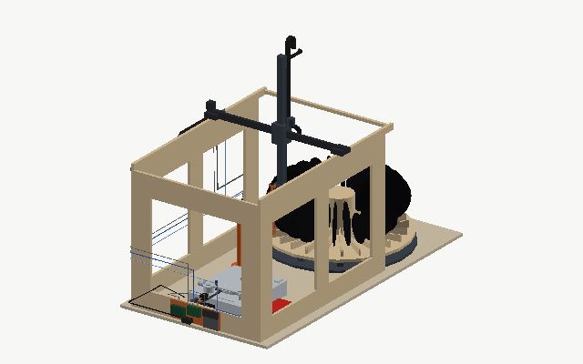

# Operating cycle

One record goes through fourteen steps. The concept model animates each of them, and the order of the axis moves within each step is the order the controller will use, not an approximation.

The cycle below is rendered from the CAD model along the planner's own keyframes, for a 12" in slot 0 with the carousel's mixed demonstration load around it; the same cycle for a [10"](images/cycle-10.png) and a [7"](images/cycle-7.png) differs only in how deep the wrist descends at the pick and the return. `cad-model.html` plays all three interactively.

## Before a batch

The user brushes each record by hand and loads up to 24 of them into the carousel and enters the batch manifest in the web interface: one line per slot with size (12", 10" or 7"), speed (33 or 45), and flags for reverse-play or locked-groove sides; a line can also say "by hand" for a record the carousel cannot present (see below). The machine homes every axis, indexes the carousel to slot 1, and checks with the wrist camera from above that a record is present where the manifest says one is and that its spoke has the length its size implies, so a wrong size is caught before the pick. The manifest editor refuses a 12" in the slot on the front side of a 7": the wrist descends beside that spoke, 62 mm deeper for a 7" than for a 12", and a 12" there would be in its way (`05-design-decisions.md`). A 7", a 10" or an empty slot there is fine, so a run of 7"s costs one empty slot. A batch can also be run one side at a time (see below), which the manifest records so that the second run knows which side it is recording.

## The steps

**1. Pick from carousel.** At travel height the gantry positions the wrist above the gap beside the spoke at the pick position. The arm descends into the gap to the centre height of the record's size, with the cup 8 mm from the record's face, then moves along Y onto the label; vacuum on, the pressure sensor confirms the seal, and the record lifts straight up out of its slot. Spokes never touch. The record's centre is known: every size rolls to the apex of the V floor in its comb, so the radius is fixed and the height follows from the manifest's size; no camera is involved here.

**2. Place side A.** The vertical record leaves the carousel along X at travel height, passes beside the flip station, and only when it is over the deck does the wrist turn to −90° so the record is horizontal, cup on top. It is lowered to a few millimetres above the mat, centred over the spindle, and released; the spindle tip enters the hollow cup and does the final centring. The wrist then hovers over the platter with the cup pointing down and the wrist camera photographs the label, finds the centre from the spindle, and measures the lead-in and run-out radii of this side.

**3. Lift arm, engage fork.** Nothing is spinning yet; the cue-lever servo raises the arm on the deck's own damped lift. The fork descends from above and straddles the finger lift while the arm still sits over its rest.

**4. Carry arm to lead-in.** The fork walks the floating arm along its arc to the lead-in radius measured in step 2. The deck camera confirms the headshell's position.

**5. Lower needle, start.** The fork rises clear. The cue lever lowers the stylus onto the stationary lead-in groove; the deck camera confirms contact. Start is tapped. Recording on the Scarlett has already been running for a few seconds, so nothing is lost; the lead-in silence absorbs the spin-up.

**6. Run-out: stop, lift, find arm.** The recording's silence detector and the deck camera's headshell radius both indicate the run-out. Stop is tapped first, then the cue lever lifts the arm. The camera tells the gantry where the headshell actually is, which can be anywhere on the surface, and the fork descends onto the finger lift there.

**7. Carry arm to rest, lower.** The fork walks the floating arm back over the rest, rises clear, and the cue lever sets the arm down.

**8. Lift record off the platter.** Cup onto the A-side label from above, vacuum on, straight up off the spindle.

**9. Carry to station, B up.** Over the deck the wrist first swings the record to vertical, the carriage moves in Y to the station's line, and only then does the wrist swing on to B-up, so the record never sweeps past the frame's front panel. The gantry carries it to the station and lowers it until its label rests on the ring; the arm enters through the ring's opening.

**10. Release and withdraw.** Vacuum off. The cup drops straight down clear of the ring. Nothing else moves. The record stays on the rest by its label.

**11. Re-grip from above.** The arm backs out 185 mm along Y from under the record, rises, hangs straight down, crosses along Y to the far side of the station, swings to cup-down and comes down onto the B-side label. On the way in the wrist camera photographs label B; the groove radii of side B are measured over the platter in step 12.

**12. Place side B.** As step 2. Steps 3 to 7 then repeat for side B.

**13. Return to its slot.** Over the deck the wrist turns back to 0°, the record hangs vertical, travels along X beside the station and is lowered into the slot it came from. Vacuum off, the cup backs away along Y, the arm rises out of the gap.

**14. Index carousel.** The stepper turns the magazine one slot. The next record is at the pick position.

## Motion planning rules

Every move between two poses is a list of waypoints, one axis at a time, generated by a planner with these rules. The planner lives in `cad/kinematics.py`, its output is `cad/cycle.json`, and `cad/check_collisions.py` sweeps it against the CAD model.

Retreat first. If the previous pose left the cup against or under something (a spoke face, a record on the ring), the first move is a short retreat along the approach direction.

Raise to travel height. The wrist pivot travels at 54 cm above the bench: high enough that a vertical record clears the carousel's combs and the station ring's neighbourhood, and a horizontal record clears everything.

Order the horizontal moves by direction. Leaving the carousel the order is X, then Y, then wrist; heading towards it the order is wrist, then Y, then X. This keeps a vertical record moving in its own plane while it is between spokes, and only turns the wrist over the deck, where there is room to swing.

Lower, then approach. The final descent stops a few millimetres short and the last movement is a slow approach along the tool's axis.

Station poses have their own plans, because the arm has to get out from under a record before it can rise.

Every target position is either a fixed mechanical datum (the pick slot, the spindle, the ring rest, the arm rest) or a camera measurement against one. Nothing is inferred from how many records are left or how far something moved last time. The one thing the planner takes from the manifest is the record's size, and it changes only the pick and the return, by the height of the record's centre in its slot: the platter and the ring rest take every record at its centre, so steps 2 to 12 are the same for a 7" as for a 12".

## Records placed by hand

The carousel locates a record by its round edge, and the pick assumes the label at the centre of that circle. A shaped picture disc (a sawblade, a heart, a star) has no round edge to roll on, and a disc whose outline is not centred on its hole comes to rest at a height nobody can predict; the cup could hold either by its label, but the machine could not find the label. A manifest line marked "by hand" therefore skips the carousel: when the batch reaches it the gantry parks, the platter stopped, and the interface asks the user to lay the record on the spindle. From "continue" the machine does what it does for any other record: the wrist hovers over the platter and photographs and measures the side, the arm is carried to the lead-in, the side is recorded, and the arm is returned to its rest. Then it parks again and asks the user to turn the record over, and after side B to take it off. Its slot in the carousel stays empty. The same mode serves a record that is too precious to be picked, or a 10" or 7" that the user would rather not stand in a slot.

## One side per run

A batch marked "one side per run" skips steps 9 to 12: each record is picked, placed, recorded, lifted and returned, and nothing is set down on the ring rest or re-gripped. The user then turns every record in its slot, which takes about two minutes for 24, and starts the second run; the records are in the slots they came from, so the second run's manifest is the first one's with the side changed. The wrist camera photographs the label of the side being played over the platter in both runs, so both labels are still captured, and the orchestrator compares the second run's photo with the first run's: a record that was not turned shows the same label and is skipped and reported rather than recorded twice. The mode exists as the fallback the decision log describes, and as the mode the machine runs in while the re-grip is being commissioned; it halves what one unattended run can do, from both sides of 24 records to one.

## Timing

A side runs 10 to 25 minutes depending on the record. The handling between sides adds about a minute and a half, so one record takes 25 to 55 minutes and an eight-hour run digitises roughly 10 to 20 records; a full 24-slot carousel therefore covers a long day or a weekend.

## Fault handling

The rule is that the machine never tries to be clever with a stylus in a groove.

A skip is detected two ways at once: a discontinuity in the recorded audio and a jump in the headshell radius on the deck camera. Either one triggers the response: the cue-lever servo lifts the arm within half a second, without waiting for the gantry, stop is tapped, the batch pauses, and the user is notified. There is no automatic retry. The web interface offers a manual "retry from here" after the user has looked.

The end-stop pin on the cue-servo bracket means that even if the software fails entirely, the arm cannot swing past the run-out onto the label.

A lost vacuum seal during a carry is seen by the orchestrator, which polls the pressure sensor throughout every carry, and stops all motion within about a tenth of a second and holds position; the record, if it dropped, is at most a few centimetres above a surface designed to receive it, and the state is reported.

A missing record, a record of the wrong size for its manifest line, or a hole the camera cannot find at the pick position skips that slot and reports it.

Any Klipper error (a stall, an end-stop hit outside homing) halts the machine in place; the orchestrator lifts the arm via the cue lever if a side was playing, and reports.

Before every cue the X, Y and Z axes are re-homed, so a lost step earlier in the cycle cannot carry over into a move near the stylus. Lateral moves with the fork engaged are only ever made with the cue lever up.
