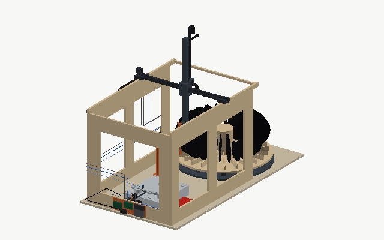

# Design decisions

The machine took its shape through a review of a series of concept models. This document records what was decided, why, and what was rejected, so the reasoning survives into the CAD and software phases.

## No stacking changer

A second-hand automatic changer costs a fraction of this machine and needs no building. It was rejected because it drops each record onto the previous one, and a record playing on a stack of records is tilted, poorly supported and audibly distorted. Every other decision follows from the requirement that a record is never supported by anything but the mat, and never touched except on its label.

## Gantry, not an arm

A Cartesian gantry with one rotary wrist was chosen over an articulated arm. Linear axes give repeatable positioning for free, a 3D-printed jointed arm is hard to make stiff, and a gantry turns the whole build into a printer-shaped problem with a printer's toolchain. The wrist is the only joint and it does two jobs: turning the record from vertical to horizontal and flipping it for side B.

## Vacuum cup on the label

Early concepts gripped the rim with three fingers. That failed on two requirements: 10" and 7" records have a different rim, and shaped records ("sawblades") have no usable rim at all. The label area is the one feature common to every record, so the gripper is a single vacuum cup on the label. A label-pinch gripper (a pin through the centre hole and a jaw on the label) was considered as an alternative that needs no pump and cannot drop a record when power fails; it was set aside because the vacuum cup is simpler and a sensor on the line gives a positive confirmation of grip (the switch first drawn became a pressure sensor; see below). 7" singles with the large jukebox hole are excluded.

## Round magazine instead of racks

The first layouts had a leaning queue for infeed and a slotted rack for outfeed, later a stepper-driven follower and a slotted comb. Each had a flaw: the queue put records face to face under pressure, the slotted rack could not accept a record with the gripper beside it at 20 mm pitch, and both needed the gantry to travel over 1.5 m. A round magazine with records as spokes solves all of it: the gap between neighbours at the label is 6.5 cm, pick and return are at one fixed position, each record goes back into its own slot, records never touch, and the X travel halved. The price is a diameter of 86 cm.

## Every size at one radius: the V floor

The concept placed records with their outer edge against a rim ring, so that every size would sit at the same outer radius and a 7" would stand where the gap between spokes is wider. The first CAD drew the ring and never used it: a ring at one height meets a 12", a 10" and a 7" at three different chords, so each size would have come to rest at its own radius, and the pick was in fact drawn for a 12" alone, standing on the disc through its comb. A wall tall enough to touch every size at its own centre, 17 cm above the disc, would stand in the way of the carried record, whose lower edge passes 7 cm above the disc at travel height. The rim is gone. Instead the floor of each comb's slot is a shallow V, 5° each way, with its apex 26 cm from the axis: a record of any diameter rolls to the apex and stands with its centre on one vertical line, and only its centre height differs, by its radius. The pick and the return are the same X and Y for every size, with the height from the manifest's size; the planner and the collision sweep take the size as a parameter, and the sweep runs the 10" and the 7" through the pick, the carry away from the slot and the return, between 12" neighbours. The 7" gives up the wider gap the rim would have given it, and the sweep showed where that bites; the next entry is the answer.

## A 7" wants a 7", a 10" or nothing on its front side

The first sweep with a 7" in the pick slot and 12" records around it found the wrist hub 18 mm and the foot of the column 7 mm inside the neighbouring spoke on the front side, the side the wrist hangs on. The geometry is simple: everything at the wrist pivot sits 22 cm above the cup, a 12" neighbour's edge reaches 15 cm above its own centre, and a 7" is picked 62 mm deeper than a 12", so the pivot hardware ends up 8 mm below that edge and its own height does the rest; at the radius where the column's foot descends the gap between spokes is 42 mm, which no column with a lead screw beside it fits. Nothing passive in the slot helps, because a floor that lifts a small disc lifts a large one at least as much. A 3 cm longer arm would lift the hub clear but pushes the re-grip pose past the Y travel unless the station moves 3 cm towards the centreline, with everything that follows from that; a hub small enough to fit would have no room for its bearings; a saddle dropped into the slot under each 7" would work until someone forgot one. The rule costs nothing: the slot on a 7"'s front side holds a 7", a 10" or nothing, so a run of 7"s costs one empty slot at its front end, and the manifest editor refuses a batch that breaks it. The collision sweep runs the 7" with a 10" in front of it, the largest neighbour the rule allows, and `python -m cad.check_collisions --size 7 --neighbour 12 --poses pick` reproduces the case it forbids. A 10" needs no rule: beside a 12" it keeps 19 mm at the hub and 32 at the column's foot.

## Shaped and off-centre discs are placed by hand

The V locates a record by its round edge, and the pick assumes the label at the centre of that circle. A shaped picture disc has no round edge to roll on, and a disc whose outline is not centred on its hole stands at a height the machine cannot know; the cup could hold either by its label, but the machine could not find the label, and one look with the wrist camera cannot help, because there is no room for it inside the gap. Rather than an adapter or a special slot, the manifest has a "by hand" line: the gantry parks, the user lays the record on the spindle, and the machine records the side, photographs and measures it, and waits for the user again at the flip and at the end. The cycle is unchanged, the carousel is untouched, and a mode the machine needs anyway for a record too precious to be picked covers every outline the V cannot.

## Wrist axis along X

With the pick slot pointing along X, the record's face is normal to Y and the cup must approach along Y, so the wrist rotates about X and the Y axis does real work: it carries the cup onto and off the spoke and it reaches 22 cm either side of the station ring for the two station poses. This set the Y travel at about 45 cm.

## Flip via a passive ring rest

A cup on one face can never place the record with that face down; somewhere the cup must change sides. Two ways were considered: a two-cup yoke that flips in the air, and a passive ring rest that the record is set down on by its label so the cup can re-grip from the other side. The ring won because it has no moving parts, it is also the best place to photograph label B, and it costs twenty seconds per side. It was moved 12 cm off the centreline once the motion planning showed that a vertical record travelling along X would otherwise pass through it.

## Moving Z column

The first gantry had a fixed Z tower hanging from the cross beam, and it swept through the brush, the platter and the station on every X move. Replacing it with a column that slides up through a guide means nothing hangs below the carriage when it is raised, and every X move happens at a travel height that clears everything by construction.

## Fork on the wrist, opposite the arm

Hanging the finger-lift fork from the carriage either dipped it into the carousel during a pick or parked the carriage a few centimetres above the tonearm while cueing. Mounting it on the wrist hub opposite the vacuum arm means it points down exactly when the arm points up, shares the cup's Y position, and keeps the carriage well above the arm.

## The deck's own cue lever does all lifting

The turntable has a manual cue lever. A servo on a frame bracket works it, so every lift and lower of the tonearm happens on the deck's damped mechanism, and the fork only ever moves the arm sideways while it is floating. The arm cannot be dropped by the machine. The platter is stopped before every stylus placement and removal, as it would be by a careful person; the lead-in silence absorbs the spin-up.

## Inner end stop

The cue-servo bracket initially collided with the arm's inner swing. That collision became a feature: a soft-sleeved pin on the bracket stands in the arm tube's path just past the run-out radius, so whatever the software does, the stylus cannot reach the label.

## Omnitronic DD 3120, not the Stanton T.92

Two decks were available. The Omnitronic has a cue lever, a remote start/stop jack and a pitch output; the Stanton has none of these and a built-in USB converter that is not wanted. The cue lever alone decides it: without one, the machine would need its own damped arm lift, which is the part most likely to damage a record. The remote jack (6.3 mm, the fader-start input of older mixers and hi-fi systems, start/stop only) is a bonus that removes all soldering on the start/stop switch. The cue lever turned out to sit at the front-right of the arm base, 3 cm from the deck's right edge, which put the cue servo on the frame's end panel with a short pusher instead of an outrigger from the rear.

## No automatic skip recovery

A skip is detected by audio and by camera at once. The response is to lift the arm via the cue lever within half a second, stop the platter, pause the batch and notify. Re-cueing automatically was rejected because a record that skipped once will usually skip again at the same place, and an unattended retry loop grinding a stylus into a scratch is the one thing the machine must never do.

## Two cameras, placed by what they need to see

An overhead camera cannot see a label or hole past the gripper. So the label camera rides on the wrist looking along the cup's axis: with the cup pointing down over the platter or the ring rest it looks straight down at whichever label is facing up, with nothing in the way, and measures the groove radii there. The deck camera sits low at platter height facing the headshell, where it sees the stylus in profile, the groove bands edge-on and the strobe dots on the rim. A rail-top camera above the deck was tried and moved for that reason. The wrist camera was first meant to look at the record's face inside the carousel gap as well; the CAD showed there is no room for a camera at a usable distance inside a 65 mm gap, and the V floor of the comb makes the record's position known well enough that no look is needed there.

## 33/45 by the deck's buttons, not by resampling

Recording everything at one speed and resampling later was rejected because the phono stage applies RIAA equalisation at fixed frequencies; a record played at the wrong speed is equalised wrongly and resampling does not undo it. The deck's 33 and 45 buttons are momentary switches, so two relay channels across the switches and a manifest column solve it properly; relays rather than optocouplers because a dry contact needs no knowledge of the switch's polarity or voltage, and the Conrad 393905 USB relay card already on hand supplies them from the Pi.

## LED strobe for speed, not camera frame rate

The camera cannot imitate a 50 Hz neon strobe, but an LED pulsed at 50.000 Hz from the controller's crystal makes the deck's dot rows, or a printed strobe ring on a deck without them, show the speed error as a drift the camera can measure. It works on any turntable, and the same LED run continuously is a raking light that shows the grooves for cueing and stylus checks. The measured speed and wow are logged with each recording rather than corrected live.

## No brush

A frame-mounted brush with a servo arm, a dust edge and a slide-out tray was designed in full and then dropped. Brushing by hand before loading takes a minute per record, is a natural moment to inspect each one, and removes a motor, a bracket, a cycle step and a source of dust inside the machine. The rear panel keeps room for the module.

## Manual deck, not an automatic one

A fully automatic turntable would have removed the cue servo, the fork, the end stop and most of the deck camera's job, and was proposed as the biggest available simplification. It was rejected because the collection contains records an automatic deck cannot play: sides with several locked grooves, sides cut from the inside out, and records with non-standard start and end positions. Those need a machine that decides where the stylus goes and when it leaves, which is why the manual DD 3120, the fork, and both cameras stay.

## V-slot instead of linear rails

X and Y run on 2040 V-slot with Delrin wheels, as on a hobby printer, instead of MGN rails. The accuracy needed at the cup is set by the hole camera and the spindle tip, well within what V-wheels give, and the change saves about a hundred euros and makes alignment easier. The Z column keeps a rail because it carries the record vertically and its guide block must not rattle.

## A used printer as parts donor

Most of the motion parts (steppers, PSU, belts, pulleys, wheels, a lead screw, end-stops, a Klipper-capable board) come cheapest as a used 3D printer; a CR-10 class machine is the best fit because of its long extrusions and lead screws. Only the two long X beams and the Z rail are bought new.

## Plywood frame, extrusion beams

A full aluminium extrusion frame was replaced by a glued box of 18 mm birch plywood with 2040 V-slot extrusion only where the X axis needs a straight, adjustable running surface. The panels give more racking stiffness than a lattice with diagonals, the interior stays open, brackets screw straight to the panels, and extrusion drops from ten metres to four. Cost is about the same; the choice is about the tools the builder prefers.

## Vacuum sensing on the Pi, the grip check in the orchestrator

The concept put a vacuum switch on a controller end-stop input so that `GRIP` could wait for it inside Klipper and a lost seal would abort inside the motion queue. Pricing it found that an industrial vacuum switch starts at about 95 €, more than the rest of the sensing together, while an Adafruit MPRLS pressure breakout costs 31 € — but is an I²C device that can only talk to the Pi. Three ways were laid out: the MPRLS alone and accept the latency; the MPRLS for the reading plus a cheap switch kept as a Klipper interlock; or the switch as drawn. The first was chosen. The seal check is an orchestrator step and the abort is one poll interval plus one Moonraker round trip, under a tenth of a second; a record being carried is never more than a few centimetres above a surface made to receive it, so that latency does not decide anything. In exchange the machine gets a pressure number rather than a contact, which tells a weak seal from none, can be logged with every side, and leaves one sensor and one tee in the cup line instead of two.

## Ring rest at the label's edge

The concept wanted the ring rest to touch nothing but the label, an annulus of 70 to 86 mm diameter; the first CAD drew the same numbers as a radius, which put the ring on the grooves and left a 7" balanced on its outermost two millimetres. Neither survived. The ring is now 100 mm in mean diameter with a 6 mm section, contacting a record between 44 and 56 mm from its centre: the edge of the label, the stiffest part of any record, with a 3 mm rubber O-ring on top for grip. Touching a 12" a few millimetres outside its label was accepted for the sake of stability and of the 7", which now overhangs the ring by 32 mm instead of 2. The size is bounded below by the cup, which needs 16 mm to the ring's inner edge and a 44 mm gap for the arm, and above by the 7".

## The flip stays, with a one-side mode as the fallback

An alternative was weighed on 14 September: no flip at all. Each run would record one side of every record in the magazine, the user would turn the records between runs, and the magazine would be made larger to keep a run long. What it removes is real: the ring rest and its three prints, four of the fourteen steps and three of the planner's four special plans, the wrist's cup-up range, and above all the two handling steps where a record is set down and picked up again with nothing to centre it. On the platter the spindle centres the record; on the ring nothing does, so the re-grip depends on the wrist camera finding the hole, which makes it the most vision-dependent step in the machine and the one with the most open questions still against it. What it costs is half the autonomy: a 24-record batch becomes two runs of 4.5 to 10.5 hours with a visit between them instead of one unattended run of 10 to 22, and the 45 seconds it saves per record are noise against a 25 to 55 minute record. The frame does not shrink either, because its 86 cm width is also what clears the carousel's base plate at the open end.

Two parts of the alternative do not survive the geometry. Turning a round magazine through 180° presents the same faces: indexing the carousel is already a rotation about its axis and never changes which face a record shows at the pick, so the user would turn every record in its slot by hand, about two minutes for 24, and needs nothing built for it. And a larger magazine is the hard part rather than the easy one: 48 slots at the present gap is a 1.7 m carousel, halving the pitch closes the 65 mm gap to 32, which nothing on the wrist fits through, and a straight rack was rejected in the concept for the same arithmetic. A magazine that flips all its records in one move would have to be straight cassettes of parallel slots on an indexing table, a different machine.

So the flip station stays: it costs almost nothing, its geometry is swept clean, and its removal buys little on paper. What the alternative does buy is a fallback, and that is taken: the batch manifest gets a one-side mode that skips steps 9 to 12, records one side of every record and returns it, and leaves the turning to the user between runs. It costs no hardware, it is the mode the machine runs in anyway while the re-grip is being commissioned, and it makes the decision about the flip one for the first records rather than for paper: if the re-grip proves unreliable, the machine still digitises. `06-open-questions.md` has the measurement that decides it.

## Electronics on the frame, not in a box

The concept put the Pi, the controller, the relay card and the pump in a box under the flip station, with the station's post standing on it. At 260 × 180 × 90 mm the box could not hold the Octopus and the 150 W supply side by side, let alone the rest; and the deck camera's ribbon would have run over a metre from it. Instead the parts mount on the outside faces of the frame panels: the controller, the supply and the bucks on the rear panel just under the X beam, centred on the cable chain's fixed end, so every gantry cable climbs 25 cm rather than a metre; the pump and valve on the rear panel near the open end, on rubber mounts, as far from the deck as the frame allows; and the Pi with its USB group on the deck-end panel, where the deck camera's ribbon is 30 cm and the relay card's cables into the deck are short. The station post stands on a printed foot on the bench. The MPRLS reads the vacuum line through a tube stub rather than over a long I²C lead, because a pneumatic line does not care about length and I²C does.

## Roller ring instead of a lazy susan

The 86 cm carousel rolls on ten printed brackets with 608 bearings around a central 6005 bearing, rather than on a bought lazy-susan ring. It is cheaper, has no play in height, spreads the load, and every part of it is printable except the bearings.

## Precision where it is printed, cheapness where it is wood

The carousel disc and base plate, the frame panels and the bench top are plywood cut to a few millimetres. Every position that matters, the slot angles, the rail line, the ring rest, is carried by a printed or bought part that registers to the wood without depending on how accurately it was cut.

## CAD in CadQuery, checked by script

The CAD is CadQuery code rather than a GUI model: every dimension is a named parameter, STEP and STL regenerate from it, and the same planner that animates the concept model produces the cycle's keyframes for a scripted collision sweep. The first sweep found five conflicts the concept model had not shown (camera in the narrowing gap, cup bracket on the spindle tip, end stop under the record's edge, fork through the rear panel, record swept into the front panel) and each became a parameter change or a planner rule. The sweep is the gate for every later change to the geometry.
