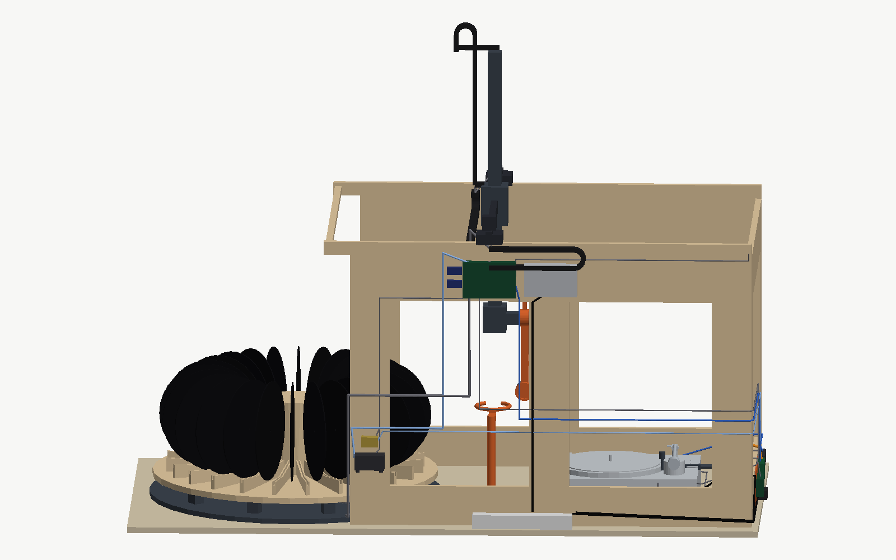
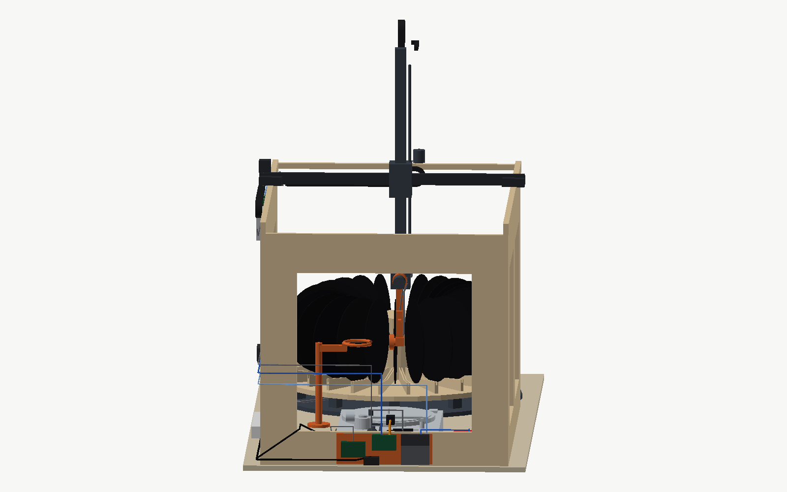
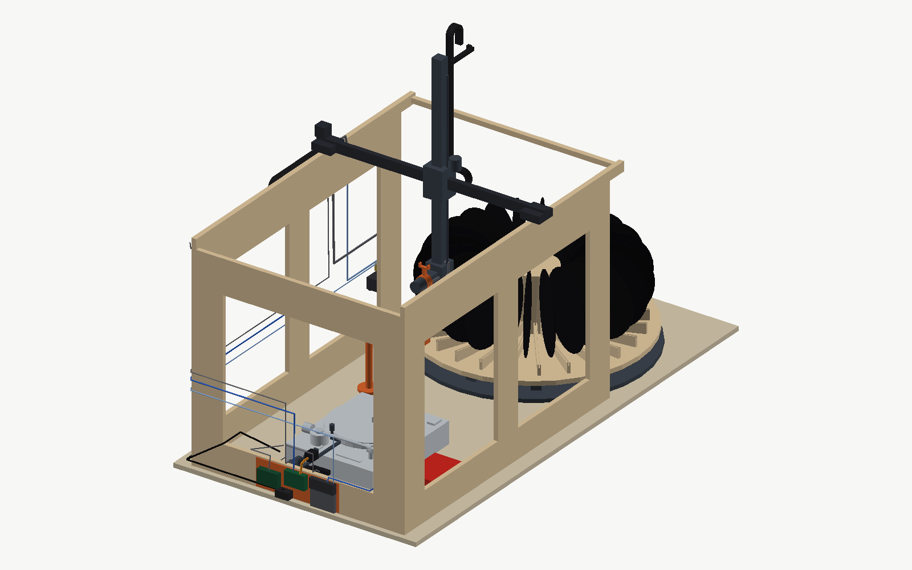

# Assembly instructions

How the machine goes together, in the order it has to, with every part named: bought, printed, cut from plywood, picked up at the Baumarkt, or already on hand. Dimensions come from `../cad/params.py`, which is the authority; where this document gives a number, that is where it came from. Nothing here has been built yet, so treat the sequence as a plan to be corrected on the first pass and written back.

Read `07-status-and-next-steps.md` first. It front-loads the things that can still change the design — measuring the deck, printing the three parts that decide the geometry — and none of the work below should start before those are done.

## Already on hand

Nothing in this table is bought. Everything in it has a place in the build.

| Item | Goes | Notes |
|---|---|---|
| Omnitronic DD 3120 turntable | On the bench under the deck end of the frame | Swap the felt slipmat for rubber or cork before the first record. The Stanton T.92 USB stays a spare and is not used |
| Ortofon DJ S cartridge | On the deck's headshell | Spherical, tracks at about 3 g; the right stylus for commissioning |
| Focusrite Scarlett | Beside the deck | USB to the powered hub, not to the Pi. The deck's line output feeds it; the Scarlett has no phono input |
| Conrad 393905 USB relay card | With the Pi group on the outside of the deck-end panel | Channel 1 to the deck's remote jack, channels 2 and 3 across the 33 and 45 buttons |
| 2 × Raspberry Pi 4B rev 1.1, 2 GB, with 15 W supplies and 32 GB cards | One runs the machine; the other is the cold spare, kept boxed | rev 1.1 refuses e-marked USB-C cables: use the official supply. The card holds the OS only, never a recording |
| External USB 3.0 SSD | With the Pi | Every WAV goes here. About 860 MB per side, about 40 GB per full magazine |
| Self-powered USB 3.0 hub | With the Pi | The Scarlett, the SSD, the wrist camera and the relay card all hang off it; the Pi's own ports budget about 1.2 A across all four |
| Logitech C270 webcam | On the wrist | The wrist camera. Fixed focus, set once by hand at the working distance over a label, then focus, exposure, gain and white balance locked |
| 1080p USB webcam | Kept | The first fallback if 720p label photographs turn out not to be enough for tagging |
| 3D printer | Prints every part in the printed-parts table | PETG for structure, TPU wherever a record is touched |

## Plywood

Everything is 18 mm birch plywood. None of the cuts needs to be better than a few millimetres — every position that matters is carried by a printed or bought part that registers to the wood — but the carousel disc wants to be flat, so take it from the middle of a sheet, not an edge that has been standing in a corner.

| Piece | Size (mm) | Qty | Cut-outs |
|---|---|---|---|
| Side panel | 1210 × 830 | 2 | Two windows, each about 420 × 570, leaving a 120 mm strip along the bottom, a 140 mm strip along the top, 120 mm posts at both ends and one at 380 mm from the carousel end |
| End panel | 842 × 830 | 1 | One window about 620 × 570, same strips, 120 mm posts at both sides. 842 is the width between the side panels' inner faces; it sits between them, at the deck end |
| Carousel disc | Ø 860 | 1 | Ø 26 hole at the centre for the stub shaft bore of the printed hub. Cut with a jigsaw against a trammel; rough is fine, the printed hub and combs carry the geometry |
| Carousel base plate | Ø 880 | 1 | The stub shaft and ten roller brackets bolt to it; a Ø 25 hole at the centre if the shaft is through-bolted |
| Bench top | 1900 × 1000 | 1 | Only if there is no bench. An existing bench of about that size does the job |

**Sheets.** This does not come out of one sheet, whatever the earlier bill of materials said. On a 1500 × 3000 sheet the two side panels stack (1210 × 1660) with the end panel below them (842 × 830) — that is sheet one, with a 290 mm strip left over. The two discs need 880 × 1740 between them and fill most of sheet two; a bench top is a third sheet, or spruce, or the bench that is already there. Have the shop cut the sheets into the rectangles at least; the windows and the discs are jigsaw work at home.

**Windows.** Drill a starter hole in each corner, jigsaw between them, and do not bother with a clean edge: the windows exist so the interior stays open, and nothing registers to them. Sand the edges where hands will go.

## Baumarkt

What the bill of materials leaves to a local shop, on top of the plywood.

- Wood glue, D3, one 250 g bottle. The frame is a glued box; the screws are clamps.
- Wood screws: 4 × 40 mm, about 40, for the panel joints and the beam blocks; 3.5 × 25 mm, about 60, for printed parts onto plywood; 3.5 × 16 mm, about 40, for the roller brackets and small brackets. Countersunk, Torx.
- Sanding: 80 and 120 grit, one sheet each; a block.
- Four rubber feet or adjustable levelling feet for the carousel base plate, so it stands flat on a bench that is not.
- One rubber O-ring, 3 mm cord, about 97 mm inside diameter (95 × 3 stretches on), NBR: it sits in the groove on top of the ring rest and is what the record actually rests on.
- Cable ties, 100 × 2.5 mm, one bag; and a few cable tie mounts with adhesive backs.
- Fabric or Kapton tape for holding cable bundles in the chains while they are dressed.
- Double-sided tape or hook-and-loop for the Pi and relay card if they are not screwed down.
- A rubber or cork turntable mat if the deck's felt slipmat is the only one there.
- Optional: a small can of clear wax or oil for the plywood, and a 40 mm hole saw for the cable exits through the panels.

Tools, if they are not there already: a jigsaw with a wood blade, a cordless drill with a 4 mm and an 8 mm wood bit and a countersink, a long straightedge and a square, four clamps of at least 90 cm reach or strap clamps, hex keys 2 to 5 mm, a set of small spanners, a soldering iron, a crimp tool for Dupont and JST-SM contacts, a heat gun for the shrink tube, digital calipers, and a spirit level.

## Printed parts

PETG unless marked TPU. The CAD marks which parts have their functional features and which are still envelopes to be detailed as the build reaches them; do not print an envelope. Print the geometry-deciding parts first, as `07-status-and-next-steps.md` says: the fork, the cup bracket and three combs with a hub, before any frame exists.

| Assembly | Part | Qty | Material | In the CAD |
|---|---|---|---|---|
| Carousel | Centre hub, 24 comb sockets and the 25 mm shaft bore | 1 | PETG | Print-ready |
| Carousel | Slot comb: the 5 mm locating slot on a V floor, 5° each way, apex 260 mm from the axis | 24 | PETG | Print-ready |
| Carousel | GT2 tooth-ring segment, dovetailed, 45° each | 8 | PETG | Envelope |
| Carousel | Roller bracket for one 608 bearing | 10 | PETG | Print-ready |
| Carousel | Index stepper mount with the 20T pulley position | 1 | PETG | Envelope |
| Carousel | Home-mark flag and the slot-sensor mount | 1 + 1 | PETG | Envelope |
| Gantry | X carriage V-wheel plate, 4 wheels each | 2 | PETG, or the donor's aluminium plates | Envelope |
| Gantry | Cross-beam end bracket, joins the cross beam to each X plate | 2 | PETG | Envelope |
| Gantry | X motor mount and the two belt idler mounts | 1 + 2 | PETG | Envelope |
| Gantry | Y wheel plate under the guide block, 4 wheels | 1 | PETG | Envelope |
| Gantry | Z guide block, rides the Y plate, carries the Z motor and the column's guide | 1 | PETG | Envelope |
| Gantry | Z carriage block with the 90 mm outrigger | 1 | PETG | Envelope |
| Gantry | Lead-screw nut holder | 1 | PETG | Envelope |
| Gantry | Column end caps | 2 | PETG | Envelope |
| Gantry | Cable-chain end brackets, X, Y and Z | 6 | PETG | Envelope |
| Wrist | Hub with the bearing seats and the stepper coupling | 1 | PETG | Envelope |
| Wrist | Arm, 220 mm, with the cup bracket at its end | 1 | PETG | Envelope |
| Wrist | Cup bracket, kept above the cup so the spindle tip meets nothing | 1 | PETG | Envelope |
| Wrist | Hose clips along the arm | 3 | PETG | Envelope |
| Wrist | Wrist camera mount, outer side of the arm, 110 mm up | 1 | PETG | Envelope |
| Wrist | Finger-lift fork, 55 mm, with prongs 28 mm apart | 1 | PETG | Print-ready |
| Wrist | Fork lining | 1 | TPU | To be added to the fork |
| Wrist | Hall sensor mount at the hub | 1 | PETG | Envelope |
| Station | Ring rest, 100 mm mean diameter, with the O-ring groove on top | 1 | PETG | Print-ready |
| Station | Post foot, screwed to the bench | 1 | PETG | Envelope |
| Electronics | Controller plate for the outside of the rear panel: Octopus on standoffs, the supply, both bucks | 1 | PETG | Envelope |
| Electronics | Pi plate for the outside of the end panel: Pi, hub, SSD, relay card, MPRLS | 1 | PETG | Envelope |
| Electronics | Pump and valve mount on rubber feet | 1 | PETG | Envelope |
| Deck interface | Cue-servo bracket for the MG996R on the end panel | 1 | PETG | Envelope, drawn for a linear servo |
| Deck interface | Pusher rod guide | 1 | PETG | Envelope |
| Deck interface | Lever pad on the rod's end | 1 | PETG or TPU | Envelope |
| Deck interface | End-stop bar and pin base | 1 | PETG | Envelope |
| Deck interface | End-stop pin sleeve | 1 | TPU | — |
| Cameras and light | Deck camera bracket on the end panel | 1 | PETG | Envelope |
| Cameras and light | LED bar housing | 1 | PETG | Envelope |

About 30 distinct parts and 50 to 70 hours of printing. The 24 combs and 10 roller brackets are the bulk of it and are also the ones to print first, because the carousel is the one sub-assembly that can be built and tested before anything else exists.

## Assembly order

Each sub-assembly is built and checked on its own before it meets the next. The order is the order of dependence: the carousel needs nothing else; the frame needs nothing else; the gantry needs the frame; the wrist needs the gantry; everything electrical needs everything mechanical to be where it will stay.

### 1. Carousel

Bolt the stub shaft to the centre of the base plate, upright, and press the 6005 bearing onto it. Screw the ten roller brackets to the base plate on a 720 mm circle, 36° apart, each with its 608 bearing on an M4 axle, all pointing radially; a paper template printed at 1:1 puts them close enough, because the disc only rests on them. Stand the base plate on its feet and level it.

Drill the Ø 26 hole in the centre of the disc. Screw the hub to the top of the disc, centred on the hole, and lower the disc onto the shaft so the hub's bore takes the bearing. Spin it: it should turn on the rollers with no rock. If it rocks, one roller bracket is high; a washer under its neighbours fixes it.

Push the 24 combs into the hub's sockets and screw each comb's outer end to the disc; the hub sets the 15° pitch, the comb slots set the record plane, and the V floors set the pick radius. Leave the slots bare: a record's edge has to roll along the V to its apex, and felt or a soft lining there would hold it wherever it landed. Fit the eight tooth-ring segments to the underside of the disc, dovetails engaged, on the 215 mm radius. Screw the index stepper mount to the base plate at the tooth ring's edge, with the geared NEMA17 and its 20T pulley meshing the ring, and fit the home-mark flag on the disc and the slot sensor on the base plate so the flag passes through it once per turn.

Stand three records in three adjacent slots and check the gap at the label radius with a ruler: about 65 mm between faces. If it is less, `06-open-questions.md` has the fallback. Then drop a 12", a 10" and a 7" in turn into one slot, anywhere along its length, and measure where each comes to rest: the centre should be 260 mm from the axis every time, within a millimetre, and 247, 222 and 184 mm above the bench. A record that stops short needs a steeper V, one number in `cad/params.py`.

### 2. Frame

Glue and screw the two side panels to the end panel, end panel between the sides, square on the bench top. Clamp, check the diagonals, let the glue cure. Screw a block of plywood offcut into each of the three lower corners as a foot if the bench is not flat.

Bolt a 1290 mm 2040 V-slot beam along the top edge of each side panel with its 40 mm face vertical and the slot facing the other beam, overhanging the open carousel end by 80 mm, using M5 bolts through the panel into T-nuts. Shim until the two beams are parallel and in one plane — this is the one alignment that matters on the whole frame, because the X carriages ride in these slots; a long straightedge across both beams, checked at three points, is the test. Bolt the 2020 tie across the open end, 880 mm long over the beams, so they stay parallel under load.

### 3. X axis

Build the two X carriage plates: four Delrin V-wheels each, two on fixed spacers and two on eccentrics, so the plate can be pinched onto the beam. Set each plate on its beam and adjust the eccentrics until it rolls the full 1290 mm with no rock and no binding. Join the plates with the 940 mm 2040 cross beam through the end brackets. The cross beam is 940 because the frame is 860 wide over the panels and the plates sit on the beams outside them; an 800 mm beam, which is what the concept had, does not reach.

Fit the X motor on the rear end bracket, next to where the X chain arrives, an idler on the front one, and run the GT2 belt along the outside of the rear X beam: fixed at both beam ends, wrapped round the motor pulley and its idler on the carriage. Tension by hand until it hums when plucked. Fit the X end-stop at the deck end of the beam.

### 4. Y axis

Build the Y wheel plate — four wheels, two eccentric — and set it on the cross beam. Screw the Z guide block to it. Fit the Y motor on one end bracket of the cross beam, an idler at the other, and run the belt fixed at both ends of the cross beam, round the pulley and idler on the Y plate. Fit the Y end-stop on the cross beam at the rear.

The planner uses 625 mm of Y travel, not the 45 cm the concept assumed: the re-grip poses reach from −340 mm to +285 mm. With 80 mm plates at both ends and an 80 mm guide block, the 940 mm cross beam gives about 700 mm, so it fits, but it means the Y cables need a chain of their own along the cross beam, not a loop.

### 5. Z column

Bolt the 800 mm MGN12 rail to the 760 mm column and its carriage into the guide block, so the column slides through the block. Fit the KFL08 bearing at the top of the column, the lead-screw nut holder on the guide block, and the T8 screw through them, coupled to the Z motor on the guide block. The column carries the screw; the nut is fixed; turning the screw lifts the column. Fit the end caps, and the Z end-stop on the guide block so the column trips it at its top. The cycle uses 430 mm of Z; the screw and rail have room for 600.

### 6. Wrist

Bolt the Z carriage block to the bottom of the column and the wrist hub to the end of its 90 mm outrigger, on the +X side, with the geared NEMA17 driving the hub through the coupling. Fit the arm to the hub pointing down, the cup bracket at its end, the bellows cup on its neck facing −Y, and the fork on the hub opposite the arm, pointing up. Fit the camera mount 110 mm up the arm on the +X side and the C270 in it, looking along the cup's axis. Fit the Hall sensor at the hub and its magnet on the arm at the hanging position.

Before the wrist goes on the machine, test the cup end by hand: 12", 10", 7" and a picture disc, held by their labels with a hand pump. Test the fork on a handle against the real headshell's finger lift. Both are in `07-status-and-next-steps.md` as the first things to print, and both have to pass before the frame is worth building.

### 7. Flip station

The ring rest stands on a post on a printed foot screwed to the bench, at X = 200 mm, Y = −120 mm, Z = 300 mm, with its 60° opening towards the front. Screw the foot to the bench, the post into the foot, the horizontal arm to the post so it runs under the ring and never touches a record on it, and the ring to the riser. Seat the O-ring in the groove on top; it stands a millimetre proud and the record rests on it, not on the print. The ring is 100 mm in mean diameter, so it holds a record at the edge of its label: a 7" overhangs it by 32 mm, the cup has 16 mm to its inner edge, and the arm passes through the 60° opening with 10 mm a side.

### 8. Deck interface

Set the deck on the bench inside the frame with its spindle at X = 550, Y = 0, and screw a plywood stop against two of its feet so it goes back to the same place after every lift-out. Measure everything `07-status-and-next-steps.md` says to measure before this point; the bracket positions below depend on those numbers.

Screw the cue-servo bracket to the inside of the end panel at the cue lever's height, with the MG996R in it and the pusher rod through its guide so the rod's pad meets the lever's tip along X. The servo's horn drives the rod through a short link; the rod's travel is the lever's travel plus a few millimetres, and its end stop is the bracket, so the servo can never push the lever past its own stop. Screw the end-stop bar to the same bracket so it runs in front of the arm base and under the arm, with the TPU-sleeved pin standing 45 mm from the arm pivot; with the arm swung by hand, the tube must meet the sleeve before the stylus reaches a radius of about 53 mm.

Screw the deck camera bracket low on the end panel at platter height, 30 mm inside the panel, 20 mm to the front, 155 mm up, facing the headshell across the platter, with the LED bar housing beside it aimed low across the platter surface. Run the Camera Module 3 ribbon and the LED wires out through a hole in the panel.

Plug the 6.3 mm mono cable into the deck's remote start/stop jack. Open the deck, find the 33 and 45 button switches on the front-left board, measure the voltage across each with the deck on, and solder two thin wires across each switch's legs, led out through the case under the board. Close the deck. Nothing else in it is touched.

### 9. Electronics

Nothing is boxed. The parts sit on the outside faces of the frame panels, where they are reachable, cool and out of the record's space, in two groups joined by one USB cable. The CAD places every board and box at its catalogue size (`cad/parts/electronics.py`), and the two views below are rendered from it: the rear panel with the controller group, the pump and the X chain, and the deck-end panel with the Pi group.

**Controller group, outside the rear panel, just under the X beam and centred on the X chain's fixed end at X ≈ 200 mm.** The Octopus on a printed plate on standoffs; the 24 V supply beside it, with its mains inlet fused and earthed; the 24 → 12 V buck for the pump, the valve and the LED bar; and the 24 → 5 V buck for the servo — the servo alone, never the Pi, because an MG996R stalls at about 2.5 A. Every cable to the gantry climbs 25 cm from here into the X chain instead of a metre up from a box on the bench, which takes most of a metre off every gantry cable.

**Pump and valve, outside the rear panel near the open end, at about X = −100 mm, on rubber mounts.** As far from the deck as the frame allows: a diaphragm pump is a vibration source, and the deck sits between X = 366 and 816. The hose runs along the outside of the panel to the chain anchor and up. The MPRLS is not here. It is an I²C device, and I²C does not like the 1.7 m to the Pi, but a vacuum line does not care about length: a tube stub tees off at the valve and runs to the sensor beside the Pi. The stub's 20 ml of dead volume is nothing against a 1 L/min pump.

**Pi group, outside the deck-end panel, low, beside the hole for the deck camera's ribbon.** The Pi on a printed plate with a heatsink, its own 15 W supply, the powered hub, the SSD, the relay card and the MPRLS; the Scarlett on the bench beside the deck. The deck camera's ribbon is 30 cm through the panel, the relay card's cables into the deck about a metre, and the Pi's USB-C cable to the Octopus 2.2 m along the outside of the panels. Two mains supplies, one at each end, so a power strip runs along the rear panel.

Wire the five TMC2209 sticks into the Octopus with UART jumpers set, X, Y, Z, wrist and carousel in that order; the servo to the servo header; the pump, valve and LED to three fan or heater MOSFET outputs, the LED on a hardware PWM pin; every end-stop, the Hall sensor and the slot sensor to end-stop inputs. Set the TMC run currents in `printer.cfg` and nowhere else.

### 10. Cabling

Three cable chains, 10 × 20 mm, R28, not two: the concept drew one along the X beam and one along the column and forgot that the Y carriage moves 625 mm along the cross beam. The chain lengths below are half the travel plus the bend allowance plus 150 mm for the mounts, rounded up; the 3 m bought covers all three with a metre spare.

| Chain | Runs along | Travel it covers | Length |
|---|---|---|---|
| X | A trough on the rear panel's outer face just under the X beam, fixed end at mid-travel | 857 mm | 700 mm |
| Y | The −X side of the cross beam, fixed end at the rear X plate | 625 mm | 600 mm |
| Z | Standing above the guide block on the −X side of the column, fixed end on the block, moving end on a post on the column top | up to 600 mm | 600 mm |

The CAD draws the three chains and the cables that feed them at the home pose, since their shape changes with every move; the collision sweep checks the electronics, the post on the column and the cable runs that ride rigidly on the column and the wrist, and leaves the chains out. Three placements came out of drawing them. The X chain cannot share the beam's outside face with the X motor, so it lies in a trough on the panel under the beam and the motor sits on the rear end bracket above it, where its lead is a hand's length from the chain's moving end; a motor on the front bracket would have needed its cable to cross the whole cross beam past the moving Y carriage. The Z chain stands up rather than hanging down: a chain hanging from the guide block beside the column would need 850 mm and would dip between the spokes at the pick, so it is fixed on top of the guide block and its moving end is a post on the column top, which puts its bend about 1.45 m above the bench at the top of the travel, where nothing else is. The gantry cables enter the column top, run down the column's −X slot under a cover, come out above the Z block, cross to the outrigger and enter the wrist hub; the hose and the camera cable then run down the +Y face of the arm, opposite the cup, so they never enter the ring rest's opening.

Everything to the gantry leaves the controller group on the outside of the rear panel, climbs 25 cm to the beam, enters the X chain, crosses to the Y chain on the cross beam, and, for anything on the column or the wrist, enters the Z chain. Dress each chain with its cables laid flat and not crossing, the vacuum hose on the outside of the bend, and a cable tie at each chain end only — nothing tied inside the chain.

**Cable lengths.** Each length is the routed path from where the cable starts — the controller group for anything Klipper drives or reads, the Pi group for anything the Pi drives or reads, the pump for the hose — to the device, with 15 % added and rounded up to the next 10 cm. The rule is that a cable which turns out too long is fixed with a cable tie and a cable which turns out too short is a new cable, so every number here errs long, and the loop that results is dressed into the chain. Where the bill of materials already names a length, the verdict says whether it reaches.

| Cable | Route | Buy | In the BOM | Verdict |
|---|---|---|---|---|
| Vacuum hose, pump to cup, 6 × 4 PU | Pump, along the rear panel to the chain anchor, X, Y and Z chains, arm to the cup neck, plus plumbing at the pump | 4.5 m | 7 m | Reaches |
| Tube stub, valve tee to the MPRLS at the Pi | Along the outside of the rear panel and round the corner | 2.1 m | in the 7 m | Reaches: 6.6 m of the 7 used |
| Wrist camera USB, C270 | Controller group up the chains to the camera mount, 110 mm up the arm | 3.2 m | The C270's fixed 1.5 m | Does not reach. Add a 2 m USB 2.0 A-to-A extension; 3.5 m total, well under the 5 m passive limit |
| Wrist stepper, 4-core | Same path to the outrigger | 3.0 m | Motor lead, about 1 m | 2 m extension |
| Wrist Hall sensor, 3-core | Same | 3.0 m | Bare module | 3 m of 3-core |
| Z stepper, 4-core | To the guide block on the Y carriage | 2.1 m | Motor lead, about 1 m | 1.1 m extension |
| Z end-stop, 3-core | Same | 2.1 m | 0.5 m lead | 1.6 m extension |
| Y stepper, 4-core | To the cross-beam end on the X carriage | 1.3 m | Motor lead, about 1 m | 0.3 m extension, or mount the motor at the near end and use the lead |
| Y end-stop, 3-core | Same | 1.3 m | 0.5 m lead | 0.8 m extension |
| X stepper, 4-core | To the X carriage | 1.3 m | Motor lead, about 1 m | 0.3 m extension |
| X end-stop, 3-core | Fixed at the deck end of the X beam | 1.2 m | 0.5 m lead | 0.7 m extension |
| Deck camera CSI ribbon | Pi group through the panel to the bracket | 0.3 m | 0.5 m | Reaches with 20 cm to fold |
| LED bar, 2-core 12 V | Controller group along the outside of the panels to the end panel | 2.3 m | Strip only | 2.3 m of 2-core |
| Cue servo, 3-core 5 V | Controller group to the end panel at lever height | 2.1 m | MG996R lead, 0.3 m | 1.8 m extension |
| Carousel stepper, 4-core | Controller group along the rear panel, down to the base plate | 2.6 m | Motor lead, about 1 m | 1.6 m extension |
| Carousel home sensor, 3-core | Same | 2.6 m | Bare module | 2.6 m of 3-core |
| Pump and valve drive, 2 × 2-core 12 V | Controller group along the rear panel to the pump mount | 1.0 m each | — | 2 m of 2-core |
| Pi to Octopus, USB-C | Pi group along the outside of the panels to the controller group | 2.2 m | — | Buy a 3 m USB-C cable; the extra is a tie |
| Deck remote start/stop, 6.3 mm | Relay card to the deck's rear jack | 1.2 m | 1.8 m | Reaches with 60 cm to tie up |
| 33 and 45 button taps, 2 × 2-core thin | Relay card into the deck's front-left board | 1.4 m each | Thin wire | 3 m of thin 2-core |

The extensions add up to about 6 m of 4-core for the steppers, 12 m of 3-core for the sensors and the servo, 4 m of 2-core for the LED, the pump and the valve, 3 m of thin 2-core for the buttons, a 2 m USB extension, a 3 m USB-C cable and 7 m of tube. Silicone 20 AWG is the right wire for the steppers, the servo and the 12 V loads; the sensors can take 24 AWG.

### 11. Power-up and commissioning

Power the Octopus alone first, no motors connected, and flash Klipper. Connect one stepper at a time and jog it a few millimetres in each direction at low current before connecting the next; a stepper wired backwards is found here and nowhere worse. Home each axis by hand against its end-stop and set the soft limits in `printer.cfg` from what the ruler says, not from the CAD, then confirm that the Z hard limit stops the column above its lowest working height.

Power the Pi from its own supply, with the hub, and bring up Moonraker, the orchestrator and the web interface. Calibrate the datums through the interface with the cameras live, in this order: the pick slot's centre, the spindle, the ring rest, the arm pivot, and the arm's rest, lead-in and run-out angles for the deck as measured. Run the cycle in step-through mode with no record, then with a sacrificial record, then with a good one, and only then a batch.

The collision sweep in `../cad/check_collisions.py` runs against the CAD, not the machine. Every number that a ruler changed on the real deck goes into `../cad/params.py` first, the sweep runs, and only a clean sweep is allowed to become a soft limit.
